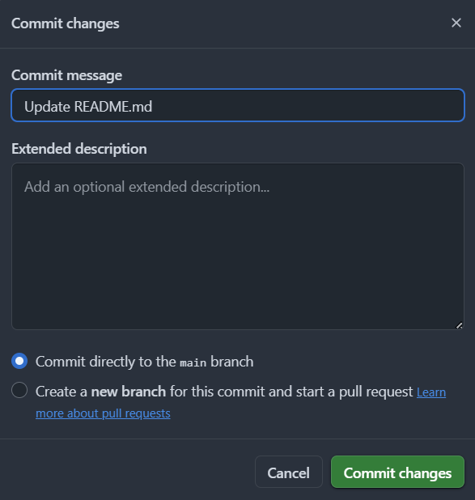

# Welcome to **[LUAstro.space](https://www.luastro.space)**'s directory!

In this README file, I'll explain the basics of the website's code as of the time of writing. I've split this document into several parts detailing, firstly, how to use GitHub (which the site is, of course, hosted in), 
how each page is formatted (with templates for new Blog pages), how the header, footer, image, and main container code works, and lastly some of the more technical parts like the Stylesheet's code, the scripts code, and (in my opinion 
the most complicated bit of code on the site) how the search bars work and how to add new pages or images to the results.

If you're a future LUAstro member in charge of maintaining this site, welcome, and don't worry too much. I've purposefully tried to make this document as thorough as possible and you probably won't need to know most of it. I didn't have too much coding experience before 
making this site, so don't worry if you haven't either, and much of this is all very straightforward to get to grips with. As the new person in charge of the site, feel free to make any changes you wish! Just bear in mind that 
another Exec member will take over from you at some point, so try and leave comments in your code, or even update this README in order for them to understand the changes.

> Thank you for reading, and happy coding! - John Ray (LUAstro 25/26 President)

<h1>GitHub, an Introduction</h1>

Hosting a website in GitHub has numerous benefits. Firstly, it's free, which is a massive plus! Secondly, it enables easy changes to be made via the green "Commit changes..." button you'll see when you open pages or by 
creating a new pull request (we'll get into them later), and lastly, it has a decent storage capability and good updating time. However it has its drawbacks too, which you should be made away of.

<h2>Downsides to GitHub hosting</h2>

As you can maybe guess already, GitHub isn't built solely around website hosting. Usually, it's used as a public repository for coding projects (whether that be the code for Siril, or for some niche Minecraft plugin, all 
sorts of code is put on here). As a result, some of the parts of GitHub can actually seem a little counter-intuitive for website development, making things more difficult for people who are inexperienced at web development. 
Another drawback is that free GitHub repositories can be "forked". What this means is that all of this code you see here, including this README file, is technically publically accessible by anyone, and can be "forked" (copied 
whilst sharing visibility settings) by absolutely anyone too. As a result, I'd recommend that you keep the name of this GitHub account confidential (which I didn't really make easy when I just called the account "LUAstro", 
sorry about that). The most major drawback though is that there is no easy UI for web development - you have to write the fundamental CSS, HTML & JavaScript code yourself (or use an AI chatbot to do it). This is a benefit too 
in that you'll hopefully get a neat bit of coding experience from all this, but does make adding in new things, even just a new container type, a bit of a pain. Sites like Wordpress, SquareSpace, Wix, etc. exist that can 
enable developers to just easily add things in without coding at all, even with basic templates available to begin with, so maybe one day the site will be moved to one of them instead - I'll leave that up to future Execs.

<h2>The basics</h2>

So, where to begin then? First of all, navigate to the README.md file in the root directory, and click on the edit button (shown by the green triangle in the image below).

From here, you can enter the edit mode of any page in the directory. You'll see a "Cancel changes" button and a "Commit changes" button in the top right which you can use to ignore or apply changes respectively. To the top-left below the blue rectangle "Website" button in the image, you should see buttons saying "Edit" & "Preview" that allow you to easily see what your changes would look like without leaving the edit mode and before applying them. This is very handy for debugging.

The blue rectangle section is the name of your file, which you can edit by simply typing in the box (you can create a folder by typing /foldername/ before entering your file name). To get a site name in the form "luastro.space/pagename/" you would need to save a HTML file with the name showing up there as "website/pagename/index.html". The first "/" denotes the root directory folder (the main folder in which all the code is saved). For ease of access, I've put all images in a "/images/" folder (so all images must be referenced as "/images/imagename.imagetype"), and all scripts in a "/scripts/" folder (so all JavaScript scripts are referenced as "/scripts/scriptname.js"). This improves navigation of the GitHub page and, in the case of the scripts, actually reduces loading time by a small bit.

Another file you should be aware of is the "404.html" file in the root directory. As the name suggests, this is the page that shows when any non-existent page on the site is visited. If deleted, a default Github 404 page is shown, which isn't ideal for the reason I mentioned in the Drawbacks section earlier.

If you make a small edit to a page and click the "Commit changes..." button, the following box appears:

Changing the Commit message or adding a description of the change is not required. As this site isn't an open-source piece of software, it isn't even particularly helpful either, so you can just click "Commit changes" to save your edit.

Finally, in the root directory, or on the most-recently edited page, you'll then see text appear and a circle as shown by the red circle in the first image. This turns into a green tick once the change is finalised. Edits can take anytime from 30s to 5 minutes to save, so don't worry if it takes a while.

<h2>Pull requests and branches</h2>

I'm only going to mention this as a partial aside. As mentioned earlier, GitHub is designed mainly around public coding repositories, which sometimes require larger changes to be made across multiple files simultaneously. To do this, GitHub can enable repositories to have "branches". As the name suggests, branches are essentially offshoots of the main repository. For example, let's say you wanted to change the header image on all the webpages. One solution would be to perform several commits, one on each page, updating each page individually. Another, better solution however is to use branches and create a branch (a copy of the original luastro.space code in its entirety) with each image updated. Then the branch can be "pulled" to the main branch (the actual main repository) to make the header images on each webpage update simultaneously. You can create a branch and pull request by switching to the "pull request" tab at the top of the GitHub page. I don't use them much personally, but if you wish to find out more visit the link below:    https://docs.github.com/en/pull-requests/collaborating-with-pull-requests/proposing-changes-to-your-work-with-pull-requests/about-pull-requests.

> Congrats, you now know how to make edits to GitHub pages!

<h1>Web development, an Introdution</h1>

There are three main computer languages that are vital to frontend web development: HTML, CSS, & JavaScript. Knowledge of these languages to some degree is vital if you wish to code a website. Here, I'm going to go over the most fundamental basics of each language. If you wish to learn more, I'd highly recommend the free tutorials available on W3schools for a more thorough overview.

<h2>HTML</h2>

HTML, or HyperText Markup Language, is the standard language for defining the structure and content of a webpage. It is the most important of the three, and, rather convienently, is in my opinion the easiest of the three to learn.

To create a HTML document (for example the homepage of the website), you first need to ensure the correct version of HTML is used, rather than other older versions or different languages like XML. To do this we have a small initialisation tag at the top of any HTML page:

`<!DOCTYPE html>`

which ensures that the most current version is used. We also ensure that the file ends in .html, and use this tag to set the default language as english:

`<html lang="en">`

Additionally, as explained earlier, almost all of the HTML documents in the repository have the form of /pagename/index.html, too. Now, for the basic formatting:

`<head>`
`</head>`

This is the next part of code you'll see on the webpages. Inside the `<head>` tag contains the metadata page code, the flavicon code (the image shown at the top of browsers), the title shown in browsers, any used non-default fonts, and very importantly, code linking the page to the CSS stylesheet. Don't worry, I'll explain all of this in more detail later on. Most HTML tags need to be ended by typing a `/` in front of their initial names. This is to prevent conflict with other tags, and to accurately contain code to determined sections of the page.

`<body>`
`</body>`

This is the main part of code. Inside the body of the page is all the code for everything shown on the physical page, including any JavaScript scripts.

`<header>`
`</header>`

This is the code to create a header for the webpage (where the top image, the navigation bar, etc. shows).

`<main>`
`</main>`

This is the tag in which all of the "main" code goes, such as containers, images, etc.

`<footer>`
`</footer>`

This is the code to create a footer for the webpage (similar to the header).

`</html>`

Finally, the html tag **must** be closed for the page to work correctly.

All other parts will be explained in more detail later.
