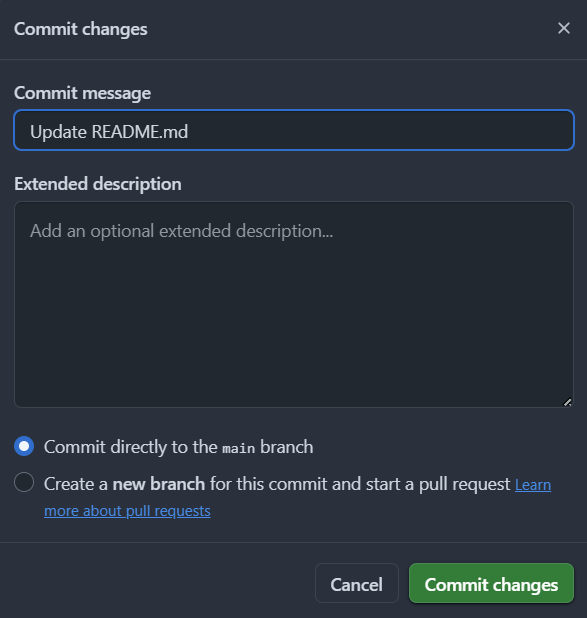

# Welcome to **[LUAstro.space](https://www.luastro.space)**'s directory!

In this README file, I'll explain the basics of the website's code as of the time of writing. I've split this document into several parts detailing, firstly, an Introduction to GitHub (which the site is, of course, hosted in), followed by an Introduction to Web Development (the basics of HTML, CSS & JavaScript),
how each page is formatted (with templates for new Blog pages), how the header, footer, image, and main container code works, and lastly some of the more technical parts like the Stylesheet's code, the scripts code, and (in my opinion 
the most complicated bit of code on the site) how the search bars work and how to add new pages or images to the results.

If you're a future LUAstro member in charge of maintaining this site, welcome, and don't worry too much. I've purposefully tried to make this document as thorough as possible and you probably won't need to know most of it. I didn't have too much coding experience before 
making this site, so don't worry if you haven't either, and much of this is all very straightforward to get to grips with. As the new person in charge of the site, feel free to make any changes you wish! Just bear in mind that 
another Exec member will take over from you at some point, so try and leave comments in your code, or even update this README in order for them to understand the changes.

> Thank you for reading, and happy coding! - John Ray (LUAstro 25/26 President)

<h1>An Introduction to GitHub</h1>

Hosting a website in GitHub has numerous benefits. Firstly, it's free, which is a massive plus! Secondly, it enables easy changes to be made via the green "Commit changes..." button you'll see when you open pages or by 
creating a new pull request (we'll get into them later), and lastly, it has a decent storage capability and good updating time. Lots of student societies, students like myself, and even the odd lecturer use it to host websites for this reason (e.g. the [University of Oxford's Astronomy Society](https://ouspaceastronomy.github.io/), [Lancaster University's Computing Society](https://www.compsoc.io/), the Astrophysics lecturer [Professor Brooke Simmons](https://vrooje.github.io/), and [this cool guy](https://johnray.co.uk)). However it has its drawbacks too, which you should be made aware of.

<h2>Downsides to GitHub hosting</h2>

As you can maybe guess already, GitHub isn't built solely around website hosting - in fact, it is used as a public repository for tons of coding projects (whether that be the code for Siril, or for some niche Minecraft plugin, all 
sorts of code is put on here). As a result, some of the parts of GitHub can actually seem a little counter-intuitive for website development, making things more difficult for people who are inexperienced at it. 
Another drawback is that free GitHub repositories can be "forked". What this means is that all of this code you see here, including this README file, is technically publically accessible by anyone, and can be "forked" (copied 
whilst sharing visibility settings) by absolutely anyone too. As a result, **please don't put anything confidential on the website**! That includes members' details of course, but also means that you **should NOT add any user accounts to the website** or anything that involves passwords. Additionally, please keep this directory a little hidden if possible (even though I haven't), to add an extra layer of security.

The most major drawback though (as you have probably realised already) is that there is no easy UI for web development - you have to write the fundamental CSS, HTML & JavaScript code yourself (or correct the broken code an AI chatbot would make instead). This is a benefit too 
in that you'll hopefully get a neat bit of coding experience from all this, but does make adding in new things, even just a new container type, a bit of a pain. Sites like Wordpress, SquareSpace, Wix, etc. exist that can 
enable developers to just easily add things in without coding at all, even with basic templates available to begin with, so maybe one day the site will be moved to one of them instead - I'll leave that up to future Execs.

<h2>The basics</h2>

So, where to begin then? First of all, navigate to a file (for example this README.md file) in the root directory, and click on the edit button (shown by the green triangle in the image below).

From here, you can enter the edit mode of the page. You'll see a "Cancel changes" button and a "Commit changes" button in the top right which you can use to ignore or apply changes respectively. To the top-left, below the blue rectangle "Website" button in the image, you should see buttons saying "Edit" & "Preview" that allow you to easily see what your changes would look like without leaving the edit mode and before applying them. This is very handy for debugging.

The blue rectangle section is the name of your file, which you can edit by simply typing in the box (you can create a folder by typing /foldername/ before entering your file name). To get a site name in the form "luastro.space/pagename/" you would need to save a HTML file with the name showing up there as "website/pagename/index.html". The first "/" denotes the root directory folder (the main folder in which all the code is saved). For ease of access, I've put all images in a "/images/" folder (so all images must be referenced as "/images/imagename.imagetype"), and all scripts in a "/scripts/" folder (so all JavaScript scripts are referenced as "/scripts/scriptname.js"). This improves navigation of the GitHub page and, in the case of the scripts, actually reduces loading time slightly (or so a random website developer told me).

Another file you should be aware of is the "404.html" file in the root directory. As the name suggests, this is the page that shows when any non-existent page on the site is visited. If deleted, a default Github 404 page is shown, which isn't ideal for the reason I mentioned in the **Downsides to GitHub hosting** section earlier.

If you make a small edit to a page and click the "Commit changes..." button, the following box appears:

Changing the Commit message or adding a description of the change is not required. As this site isn't an open-source piece of software, it isn't even particularly helpful either, so you can just click "Commit changes" to save your edit.

Finally, in the root directory, or on the most-recently edited page, you'll then see text appear and a circle as shown by the red circle in the first image. This turns into a green tick once the change is finalised. Edits can take anytime from 30s to 5 minutes to save, so don't worry if it takes a while.

<h2>Pull requests and branches</h2>

I'm only going to mention this as a partial aside. As mentioned earlier, GitHub is designed mainly around public coding repositories, which sometimes require larger changes to be made across multiple files simultaneously. To do this, GitHub can enable repositories to have "branches". As the name suggests, branches are essentially offshoots of the main repository. For example, let's say you wanted to change the header image on all the webpages. One solution would be to perform several commits, one on each page, updating each page individually. Another, better solution however is to use branches and create a branch (a copy of the original luastro.space code in its entirety) with each image updated. Then the branch can be "pulled" to the main branch (the actual main repository) to make the header images on each webpage update simultaneously. You can create a branch and pull request by switching to the "pull request" tab at the top of the GitHub page. I don't use them much personally, but if you wish to find out more visit the link below:    https://docs.github.com/en/pull-requests/collaborating-with-pull-requests/proposing-changes-to-your-work-with-pull-requests/about-pull-requests.

> Congrats, you now know how to make edits to GitHub pages!

<h1>An Introdution to Web Development</h1>

There are three main computer languages that are vital to front-end web development: HTML, CSS, & JavaScript. Knowledge of these languages to some degree is vital if you wish to code a website. Here, I'm going to go over the most fundamental basics of each language. If you wish to learn more, I'd highly recommend free tutorials available on [W3schools](https://www.w3schools.com/), [Codecademy](https://www.codecademy.com/), etc. for a more thorough overview.

<h2>HTML</h2>

HTML, or HyperText Markup Language, is the standard markup language for defining the structure and content of a webpage. It is the most important of the three, and, rather convienently, is in my opinion the easiest of the three to learn.

To create a HTML document (for example the homepage of the website), you first need to ensure the correct version of HTML is used, rather than other older versions or different languages like XML. To do this we have a small initialisation tag at the top of any HTML page:

`<!DOCTYPE html>`

which ensures that the most current version is used. We also ensure that the file ends in .html so that the file is the correct type, and use this tag to set the default language as english:

`<html lang="en">`

Additionally, as explained earlier, almost all of the HTML documents in the repository have the form of /pagename/index.html, too. Now, for the basic formatting:

`<head>`
`</head>`

This is the next part of code you'll see on the webpages. Inside the `<head>` tag contains the metadata page code, the flavicon code (the image shown at the top of browsers), the title shown in browsers, any used non-default fonts, and very importantly, code linking the page to the CSS stylesheet. Don't worry, I'll explain all of this in more detail later on. Most HTML tags **must** be ended by typing a `/` in front of their initial names. This is to prevent conflict with other tags, and to accurately contain code to determined sections of the page.

`<body>`
`</body>`

This is the main part of code. Inside the body of the page is all the code for everything shown on the physical page, including any JavaScript scripts. The `<header>`, `<main>` & `<footer>` codes are all nested inside this tag.

`<header>`
`</header>`

This is the code to create a header for the webpage (where the top image, the navigation bar, etc. shows).

`<main>`
`</main>`

This is the tag in which all of the "main" code goes, such as containers, images, etc.

`<footer>`
`</footer>`

This is the code to create a footer for the webpage (similar to the header).

`</html>`

Finally, the html tag **must** be closed for the page to work correctly.

All other parts will be explained in more detail later.

<h2>CSS</h2>

CSS, or "Cascading Style Sheets" is a stylesheet language used to describe the presentation and styling of a webpage. It defines the colours of elements, padding, layout, any stylistic effects, fonts sizes, and much more. There is only one CSS file for the website, named as **styles.css**. It is this stylesheet that every page on the website references off for styling - so any changes you make to it will affect all pages on the site - and has had the code categorised into sections by me for better understanding.

You will not need to create any further CSS files for the website (although you can if you want to, of course). For simplicity, only the one CSS file is required, which you can feel free to update with new additions or changes.

I will explain how to work CSS code in more detail later on. For now, I'm just going to give a snippet of CSS code and talk you through the basics.

`/*============================
  3. Header & Navigation
============================*/`

Single-line comments are made by inserting `//` before writing on the stylesheet. Here `/* ... */` is used for a multi-line comment. Comments are how you can insert descriptions in code without affecting the code itself. Comments are written in the same way in CSS as in JavaScript, but are written differently in HTML. We'll revisit this in more depth later, in this example this is just how I've defined sections of code in the stylesheet.

`.container {`

Here we initialise the CSS element "container" that is used to create the grey text boxes on the homepage and elsewhere.

`  padding: 20px;
  max-width: 1200px;
  margin: 40px auto;`

Here we define the padding, maximum width, and margins of the container in terms of pixels shown on the page (px). Each line here **must** be ended with a **;**, otherwise later code is not run.

`  --containercolour: rgba(33, 33, 33,0.7);
  background-color: var(--containercolour);
  --textcolour: white;
  color: var(--textcolour);
  --linkcolour: #bbb;`

Here we define the background colour, text colour, and linked-text colour for the container. The `--` before the names denotes the following word as representing a variable. This means that we can actually vary this value later on in a specific .HTML page (e.g. if we wanted the text for one of the containers to be blue we could change the variable `--containercolour`), whilst having the defaults set to a white text colour (given by the word "white"), a light-grey link colour (given using a HEX colour code that denotes the exact shade as `#bbb`), and a partially transparent dark-grey colour (using an RGBA format, where the A = 0.7 represents an opaqueness of 70% in the alpha channel). I've used various different formats here for each to illustrate the options available, so don't worry if it seems confusing! Variables can have any name you wish (notice the British English "colour" in the variable names), but the properties of elements **must be referenced specifically using keywords** (notice the American English "color" in the actual property names as referring to it using the British English "colour" would not work). All CSS properties & variables are defined in the format of `Property: ValueOfTheProperty1, ValueOfTheProperty2, etc. ;`.

` box-shadow: 0 4px 8px rgba(0,0,0,0.1);
  border-radius: 8px;
  text-align: center;
  font-family: Helvetica, sans-serif;`

Here, a subtle shadow is defined in a box-shape around the container using RGBA notation (due to the choice of colour it's practically unnoticeable). The `border-radius` defines the radius of the curved edge to the container, removing any pointy ends off the box to give a smoother look. The text is aligned as center, and the exact font also defined. Fonts may sometimes need to be referenced on the .HTML page files too (usually in the `<head>` section alongside the webpage metadata and title).

`}`

Importantly, the container element is then finalised by another curly bracket.

Further specifics of the CSS code in the Stylesheet file itself will be explained later on.

<h2>JavaScript</h2>

JavaScript, a word that fills most programmers and web developers with fear, is the default programming language for websites. Unlike HTML and CSS, JavaScript is a true programming language, not a markup language, and is used on this site for niche uses like choosing an automatic background on startup or magnifying images once they're clicked on. It is the most tricky of the three to grasp, and I would **strongly** recommend learning it through an online tutorial if you wish to mess around with it. Other programming languages exist, like C, C++, Python, Java, etc. but JavaScript is considered the Web standard. On this site, all the JavaScript files are in the "scripts" folder, and end in ".js".

Below, I explain some of the basics of JavaScript with reference to the [Astro_Background.js](/scripts/Astro_Background.js) script that determines the background image for webpages once they are loaded. This barely scrapes the surface of JavaScript coding - again, online tutorials would explain it much better.

`/*`  

                       ~ Astronomy Background selector ~
                         ~ randomises on page load ~

                                by John Ray

`*/`  

Here, a multi-line comment introduces the file. As mentioned earlier, JavaScript comments are the same as in CSS.

`
  (function() {`

Here, a function is defined without any parameters (parameters are inherent properties of the function, and would usually be inserted inside the ending brackets).
  
  `  const images = [`

Here, an array is defined with the name of "images". An array is an object type that enables a collection of different items in one name. JavaScript is what's known as an "Object-oriented" programming language, with objects like arrays forming the heart of it. More information is best taught by online tutorials from people who know more than me about this kind of thing.

    `  '/images/JRAndromedaRevisited.jpg', // image selected if choice = 0
      '/images/bgRosetteNebulabyFinlay.jpg', // image selected if choice = 1
      '/images/bgOrionNebulabyIanto.jpg', // image selected if choice = 2
      '/images/JRCalNebREPROCESSED.jpg', // image selected if choice = 3
      '/images/bgPleiadesbyOrlando.jpg' // image selected if choice = 4
    ];`
    
Here, the array is filled with a set of 5 images, each denoted by their file names (with all of them in the images folder of the directory). Notice the `//` single-line comments. The array is importantly closed with another square bracket to prevent further code from being mistaken for any further entries. A single `;` is put afterwards so the browser knows to proceed to the next piece of code.

   ` const choice = images[Math.floor(Math.random() * images.length)];`

Next, a constant variable named "choice" is created. Constant variables cannot be redefined (notice how the array earlier is defined using the `const` keyword too). The keywords `var` or preferably `let` are used to define variables that can be redefined. "choice" is defined further as being an item of the array "images". Array items can be referenced by writing `arrayname[0]` for the first item in an array called "arrayname", or `arrayname[1]` for the second item, etc. so therefore, to make the image chosen random, the value in the square brackets (called the "index" of the array) must be randomised. We use the `Math.random()` function available as a default in JavaScript to do this, which chooses a random number from 0 to 1. We then multiply this number by the length of the array which is defined using a `.length` function assigned to the images array (this length will be 5 for the current array as there are 5 total entries). Lastly, the code would break if we defined "choice" as something like `images[1.36437247432]`; an array index **must** be an integer value. The `Math.floor` function fixes this, and would round the value down to 1, so the second entry (in this case a picture of the Rosette Nebula by Finlay) would be chosen as the background.

 `   document.body.style.setProperty('--page-bg', /url(${choice}));`  
`  })();`

Finally, the following code sets the CSS `--page-bg` variable that represents the page's background as the chosen image using an awkward mix of references in the form of `document.body.style.setProperty(...)`. This variable must be defined as a URL to a specific image, hence the `URL(${choice})` code (which would usually be inside a set of dropticks), where the dollar symbol references the JavaScript variable of "choice". Finally, each line is ended with a `;` and a suitable number and type of brackets.

> Congratulations! Now you know the (extremely fundamental) basics of Web Development!

<h1>Creating or editing a HTML page</h1>

Now you know the basics of Web Development, we're ready to move onto specifics. Every webpage on **[www.luastro.space](https://www.luastro.space)** has the same basic template. Each page has a header LUAstro image, a navigation bar and search bar underneath, some main text, images, or other content, and a footer at the bottom of the page. In this section, I will explain how each part of code works for these sections, before moving onto to how to use this knowledge to create new pages or blog posts in the next section. **This part is recommended**, as it will provide you with a better knowledge of how the site functions, and allow you to make changes without damaging essential parts of page code. However if you just want to make minor editions like creating new blog posts or adding new images to the Astrophotography page, and not create entire new pages, feel free to skip this part. Details of how to easily make minor changes will be explained in a later section.

<h1>The Head & Header</h1>

All pages on the site have a similar Head & Header code. This code defines the title of the page (on the physical page, on tabs, and even in search engine results), the keywords that give the page as a result when typed in the site's search bar, the top LUAstro image and flavicon, the navigation bar, and the search bar. Let's begin!

<h2>Head code</h2>

`<!DOCTYPE html>`  
`<html lang="en">`

This code initialises the page with modern HTML5, in English.

`<head>`  
<!-- Google tag (gtag.js) -->
``  
``

This begins the `<head>` code (the rather confusingly-named `<header>` code will be initialised later on), followed by a Google tag that is used to track the traffic of each webpage (using some JavaScript code nested in `
\\ Added the counter instance here:

 -->

~~Currently, the website uses www.counterapi.com to track the views of each webpage. This site is prone to crashing, and is generally unreliable. Google Analytics is a better alternative that I have yet to get working (please change to this if you're a future member!). Regardless for now, this is the best way I could figure out to monitor the site's traffic. The script calls the www.counterapi.com's half-broken API, and the `
`tag creates the individual tracker for the page. The key "socials" assigns the tracker to the name "socials" (this must be individual to each page). Ensure that nolink="true" so that visitors cannot easily view the site's traffic, but keep noIcon="false" if you can, as they must be reminded that Big Brother is watching them.~~

Previously, the website "www.counterapi.com" was used to track the views of each webpage on the LUAstro website. For unknown reasons (though likely due to a mix CounterAPI's Cloudflare servers always crashing and their domain server not handling requests correctly), this website has now ceased functioning and the number of visitors can no longer be viewed this way - which was previously done by visiting [www.counterapi.com/stats/luastro.space](https://counterapi.com/stats/luastro.space).

Since then, I've improved the code to now use Google Analytics to track webpage traffic instead, as I explained earlier. Any old counterapi code can be deleted if wished (unless you're hopeful like me and think that it will randomly start working again, or too lazy like me and can't be bothered editing it out).

`
`  
`</footer>`

Then, the `
` and the footer tags are closed.

It is here that any JavaScript scripts must be called. This is done like below:

`<!-- Cool randomised background code -->`  
``  
`<!-- Imports a fun Easter Egg code-->`  
``  

These two scripts are necessary for each page (yep, the Easter Egg code is *definitely* necessary, trust me). For pages like the search page, history page, and astrophotgraphy page, the other relevant scripts are also necessary. If the lightbox code is required (to magnify images like on the astrophotography or history pages), this following `
 ... 
` code **MUST ALSO BE INCLUDED**:

<!-- 

    

      <button class="lb-close"    title="Close">✕</button> 
      <button class="lb-maximize" title="Maximize">⤢</button>    
      
      

   
      <button class="lb-prev"     title="Previous">‹</button> 
      <button class="lb-next"     title="Next">›</button>
    

 -->

This creates the Lightbox element upon clicking (creating the fancy buttons and stuff like that). The lightbox code is all completely copied from my own website, and as such is a little broken on mobile - a future IT Officer will hopefully fix this! :)

Finally, the HTML code must be completely closed.

`</body>`  
`</html>`

Congrats, you now know how to write a new HTML file on the website!

<h1>The final essentials:</h1>

By now you should know:

* How GitHub works (how to create new pages using it, etc.).
* The basics of Web Development (the barebones essentials of HTML, JavaScript, and CSS code).
* How to create a new HTML page on the website (with new specific SEO metadata and API counters).
* How to update the blog with new entries.
* How to update the Astrophotography page with new images (on the HTML side).

So what's left?

* How to update the Astrophotography page on the JavaScript side.
* How the search bar works and how to add new entries.
* How updating lots of things at once can be made a whole lot easier with GitHub Desktop.
* And a big well done!

So let me explain the last few final essentials.

<h2>Updating Photo_Search.js</h2>

Photo_Search.js is the JavaScript code that allows images of new objects on the Astrophotography page to be correctly sorted by user entries (e.g. typing M33 will show pictures of the Andromeda Galaxy). This file can be viewed in the `/scripts/` folder of the base directory.

**Updating this is therefore necessary if you wish to add new images to the Astrophotgraphy page that are of new objects. If a photo is merely taken by a new photographer, taken during a new year, or with new equipment, you can simply update the options list on the Astrophotography page. If a photo is of multiple objects in a new combination (e.g. of B33, NGC 2024, & M42, instead of just M42) a new entry on the Photo_Search.js file MUST be created for that image, so that it returns the image as a result for each entry.**

Updating this is actually quite simple. Find the part of the file that begins:

`// Master list with our labels & aliases`  
`    const objects = [` 
`      { label: 'Andromeda Galaxy (M31)',             aliases: ['andromeda galaxy','m31'] },` 

After the comma of any entry, insert a new entry with code of the form:

` { label: 'NEW ENTRY NAME', aliases: ['Comma Separated list of search aliases', 'like', 'this'] }, ` 

Labels must be distinct, and should preferably be called after the subject of the image in question. The data-object of the appropriate image on the HTML page is then assigned to the appropriate allias. Aliases, to reiterate, are the terms that must be typed to return the image as an entry (e.g. as said earlier typing "M31" should show pictures of the Andromeda Galaxy, so "M31" should be an alias alongside "Andromeda Galaxy" for an image of that object).

The Photo_Search.js code strips any aliases of punctuation, converts non-breaking spaces into regular spaces, and then removes any regular spaces (e.g. typing "androm.e/da  ga@lax'y" would still return Andromeda Galaxy as a result). Aliases also work regardless of capitalisation. This unfortunately means that any names like Orlando Prugel-Bennett cannot be put as the names of photographers on the Astrophotography page (as the "-" is removed, causing an error). I've taken to simply abbreviating double-barrelled names in this case as a workaround. ~~If only I could remove double-barrelled names in real life too.~~

<h2>Updating the Search Bar</h2>

This is the most complex bit of code on the site, so I've left it until last to explain. From tracking every visitor to the website like a completely normal person, I've realised that virtually no-one uses the search bar (and that a lot of American bots frequent the site for some reason); so there's little worry if you can't get this bit working.

The basics of the Search Bar was mentioned earlier in the Header Code subsection. It works by generating a page from the `/search/index.html` page. That page contains the following specific HTML code:

    <main>
    

      <h2>Search results:</h2>
      

    

    

    </main>

Simple enough, right? All that does is create a container with the header "Search results:" and an internal id provided by `

`. The real complexity comes from the JavaScript side, which defines that internal id by having the Search_Code.js file attached to the HTML page like below:

``

This loads the aforementioned "Search_Code.js" file. This file is composed of 6 parts - please click [HERE](https://github.com/LUAstro/LUAstro-website/blob/main/scripts/Search_Code.js) to view the file and see what I'm talking about.

The only part of this file that needs understanding / updating is the first section, which is a list of all the entries that can show up when searching. As you'll hopefully remember earlier, each webpage has metadata attached to it using `<meta>` tags. An example of this is shown below:

<!--
  <meta charset="UTF-8" />
  <meta name="viewport" content="width=device-width, initial-scale=1.0"/>
  <meta name="description" content="Newsletters page - contains all the most recent newsletters by the Society">
  <meta name="keywords" content="Newsletters, News, updates, info, latest news, communications, LUAstro">
  <title>Newsletters | LUAstro</title>
-->

The relevant bits here are the "description" and "keywords" pieces of metadata. These show the description of a webpage as it appears when searched for, and the list of potential search queries that yield the said page as a result. This metadata is fetched and parsed in the second section of the Search_Code.js file, which is then built into a page, read, filtered, and rendered using the final sections of the code.

<!--
// 1) List all the pages here (include a title and url like the ones included and put any blog entries below "LUAstro Blog")
  const pages = [
    { title: 'Homepage',            url: '/' },
    { title: 'LUAstro Store', url: '/store/' },
    ...
    { title: 'Week 1, 22/23 Newsletter', url: '/newsletters/November 2022 (Week 1).pdf', description: 'ARCHIVE: The first LUAstro Newsletter from Nov 2022 (Week 1)', keywords: 'newsletters, archive, 2022, nov 2022, week 1, first newsletter, newsletter, 22/23' },
    
    // Add new pages here—and they'll be fetched automatically
  ];
-->

This is the format of the first section - a long JavaScript array. More accurately, this defines a constant list called "pages" that has each entry defined via a JavaScript dictionary (definiing in-turn a variable called "title", a URL called "url", and, in some cases, the aforementioned "description" and "keywords" metadata if it is not already defined).

To allow new webpages to appear in search results, they must first be added to this array. The title of the page as you want it to appear should be defined via the `title` variable (in the form of `title: 'TITLE',`), and the URL should be defined by taking the path of the webpage relative to the main directory (e.g. for the store page at www.luastro.space/store/, you define the URL as `url: '/store/'`). What you might notice is that there's a different structure to the entries for webpages than there is for .pdfs. This is because .pdfs cannot contain HTML-style meta data - so it must be added here instead.

**PLEASE ENSURE THAT A COMMA IS KEPT AFTER EACH ENTRY, OR IT WILL BREAK AFTER FURTHER ADDITIONS!!!**

<h2>GitHub Desktop, Git, and other methods</h2>

There are other ways to update, copy, and download this webpage's code directory. The main method I personally use for larger changes is [GitHub Desktop](https://desktop.github.com/download/). This allows commits / merge requests to be done much easier by enabling you to easily download a copy of the entire website's code into a local folder on your device. Then, you can simply add, edit, or remove files using your device's file explorer, before committing changes via the application's UI.

This helps greatly for larger changes - such as if you wanted to reorganise files or perform lots of edits simultaneously.

For the more advanced IT Officer, you can also use [Git](https://github.com/git-guides/install-git), a lovely version control system that works via command-line scripts instead of a web or desktop application. It can be installed by clicking on the link above, but also comes pre-installed on some devices (you can test whether your device has it by typing `git version` in your device's command prompt or terminal). Experience with Git looks good on a CV - I'd recommend trying to use this to update the website if you get the chance!

<h1>Final thanks</h1>

Thank you for reading, or skipping to the end if you've done that! I've put a lot of time and effort into maintaining this website and it would be nice for it to last a good while if it can, so please take care of it. Best of luck to any future LUAstro exec, and clear skies!
